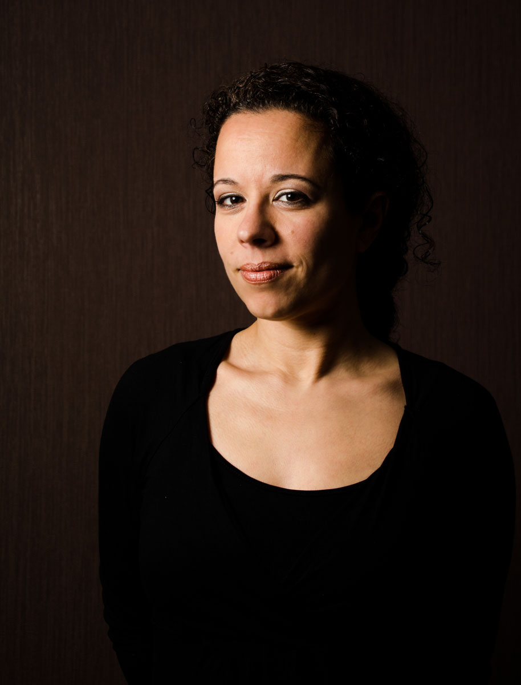

## Over mij

Fotografie, De kunst om het juiste moment vast te leggen, een gevoel over te brengen en mensen te intrigreren.

Mijn naam is Belinda Molenaar-Terrisse, woonachtig in Hoogkarspel, Noord-Holland.
Van kinds af aan ben ik gefascineerd door fotografie. Door middel van workshops heb ik mezelf ontwikkeld. Gedreven door passie probeer ik jullie te inspireren.

Mijn interesse gaan uit naar portret-, high fashion- en travel-fotografie. Beelden met een verhaal die voor eeuwig zijn vastgelegd.

Enjoy!

    
Capture the Moment by Belin

    
Telefoon: 06-1375 9292

    
E-mail: <a href="mailto:cmbybelin@gmail.com" class="email">cmbybelin@gmail.com</a>

Mocht je meer willen weten, laat dan een berichtje achter:

<form action="https://getsimpleform.com/messages?form_api_token=84cf3f47b43b7b5a616bd93710510116" method="post">
  <!-- the redirect_to is optional, the form will redirect to the referrer on submission -->
  <input type='hidden' name='redirect_to' value='http://cmbybelin.com/contact-thanks.html' />

  <label for="f_name">Naam:</label>
  <input id="f_name" type="text" name="name" style="width:320px" required placeholder="Je naam"/>
  <label for="f_email">E-mail:</label>
  <input id="f_email" type="email" name="email" style="width:320px" required placeholder="Je e-mail adres"/>
  <label for="f_message">Bericht:</label>
  <textarea id="f_message" name="message" style="width:320px" rows="12" required placeholder="Type je bericht hier"></textarea>

  <button type='submit'>Verzend</button>
</form>
